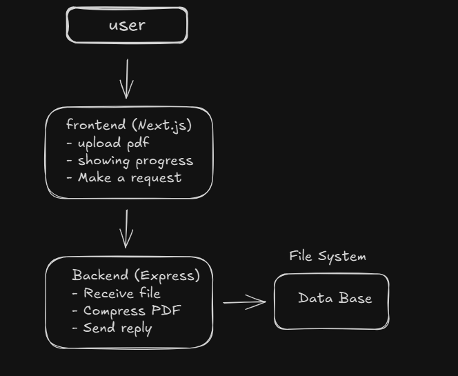

---

A scalable web platform to compress PDF files and store the request history, designed with a modern stack (Next.js + Express + MongoDB). The platform aims to reduce file sizes for more efficient storage and sharing, with future expansion support for other formats like videos and images.

## 🧠 Project Description

The PDF Compressor Web App is a fullstack application that allows users to upload and compress PDF files directly in the browser. Once a file is uploaded, it is sent to the backend where it is compressed and stored. The system also maintains a history of all submitted files with metadata such as original and compressed size, compression rate, and timestamp.

This project was born from the need for a **secure, scalable and private solution** to handle large volumes of PDF documents — such as reports, contracts, and presentations — often shared in business environments. Unlike third-party tools that expose data to unknown servers, this app is designed to be **self-hosted or company-owned**, making it a reliable choice for internal use cases with sensitive information.

> It is also designed to evolve — support for videos, images and large files is already in the roadmap.

## ✅ Functional Requirements

- Upload PDF files through drag-and-drop or file selection
- Validate file type (accept only PDFs)
- Compress PDFs on the server
- Save the file and metadata to a MongoDB database
- Display list/history of uploaded and compressed files
- Enable file download after compression

## 🚫 Non-Functional Requirements

- Responsive UI across devices
- Secure file handling and storage
- Fast response time for compression requests
- Scalable backend structure to support new file types in the future
- Clean and maintainable codebase (TypeScript)

## 📏 Business Rules

- Only PDF files are allowed in the MVP
- Maximum file size for upload: 25MB
- Each upload must be associated with a timestamp and status
- History must include filename, size before/after, and compression rate

---

## 🛠️ Tech Stack

**Frontend**  
- [Next.js](https://nextjs.org/)
- TypeScript
- Tailwind CSS (optional for styling)

**Backend**  
- [Express.js](https://expressjs.com/) (with TypeScript)
- `pdf-lib`, `pdf-compress`, or similar libraries for compression
- Multer for file handling

**Database**  
- [MongoDB](https://www.mongodb.com/)
- Mongoose for ORM

**Other Tools**  
- Git + GitHub
- Postman (for API testing)
- ESLint + Prettier (code linting and formatting)

---

## 🧱 Development Roadmap

### Phase 1 — Initial Setup
- [x] Setup project structure (`frontend/`, `backend/`)
- [x] Initialize Git repository
- [x] Create `.gitignore` for Node and Next.js
- [x] Create `README.md` with project purpose
- [x] Setup TypeScript config on backend
- [x] Run frontend (`localhost:3000`) and backend (`localhost:5000`)

### Phase 2 — Frontend: Simple Upload
- [x] Build homepage layout in `pages/index.tsx`
- [x] Create `UploadBox` component with drag-and-drop and file picker
- [x] Validate file type (only `.pdf` accepted)

### Phase 3 — Backend: File Compression
- [ ] Create upload route using Express and Multer
- [ ] Implement compression logic using a PDF compression library
- [ ] Store original and compressed file size

### Phase 4 — Database Integration
- [ ] Setup MongoDB connection
- [ ] Create schema for file metadata:
  - Filename
  - Size before/after
  - Compression ratio
  - Upload date
- [ ] Save compressed files and metadata

### Phase 5 — History & Download
- [ ] Build frontend to display user’s compression history
- [ ] Enable download button for compressed files
- [ ] Show compression stats (before/after, % saved)

### Phase 6 — Finalization and Scaling
- [ ] Improve UI/UX
- [ ] Add loading and error handling states
- [ ] Deploy on Vercel (frontend) and Render/Heroku (backend)
- [ ] Prepare the platform to support other file types (video, images, etc)

---

